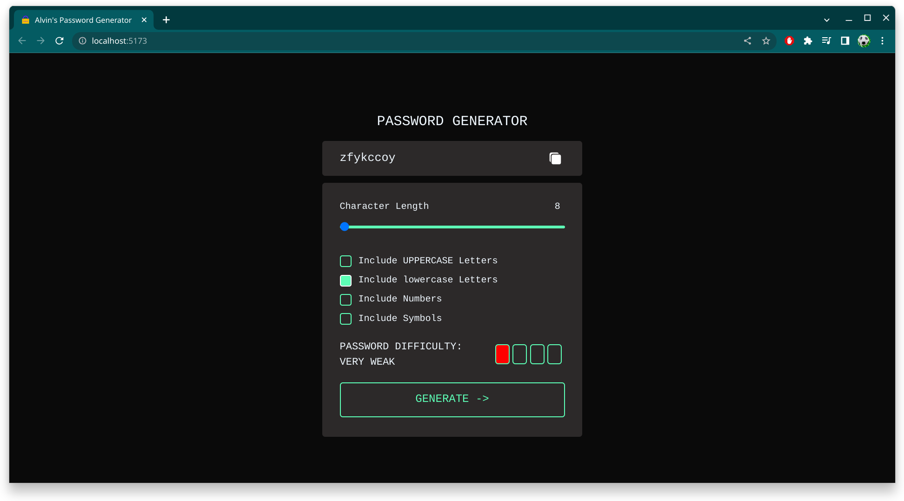
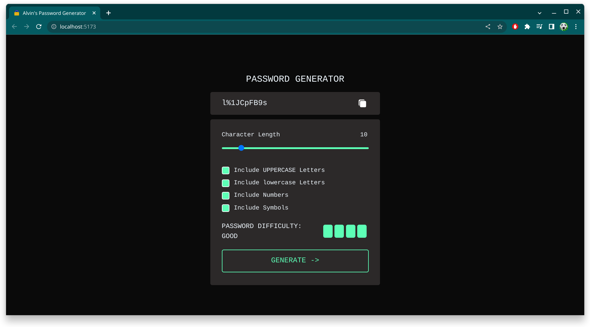

Made with...

# Password Generator

<div>


</div>

This is a simple password generator application built with Svelte. It allows users to generate secure passwords with customizable criteria such as length, including uppercase letters, lowercase letters, numbers, and special characters.

## TABLE OF CONTENTS

- [Important Links](#important-links)
- [Configuration for Local Deployment](#configuration-for-local-deployment)
- [Tech Stack](#tech-stack)
- [Usage and Features](#usage-and-features)

## Important Links

- Visit live website @ https://alvins-password-generator.netlify.app/
- Visit Client repo @ https://github.com/alvin1904/password-generator-svelte

## Configuration for Local Deployment
Clone the repository
```bash
git clone https://github.com/alvin1904/password-generator-svelte
```
Once you've created a project folder, install dependencies with `npm install` (or `pnpm install` or `yarn`)

```bash
npm install
```
To start the development server and open the app in a new browser tab
```bash
npm run dev -- --open
```

## Tech Stack

- `Svelte`: A lightweight and efficient frontend framework for building reactive web applications with a smooth developer experience.

- `Svelte Kit Icons`: A comprehensive collection of icons for Svelte Kit, providing an extensive range of high-quality visuals to enhance your Svelte Kit projects.

## Usage and Features

Once the system is installed and running, users can follow these guidelines to utilize its features:

- Generate random passwords with specified length.
- Customize password criteria to include uppercase letters, lowercase letters, numbers, and special characters.
- Copy generated passwords to the clipboard with a single click.
- Easy-to-use and intuitive user interface.
